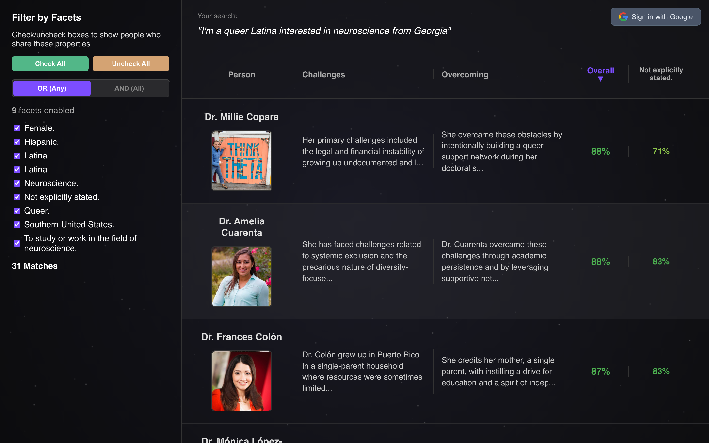

# Kindred Histories



**A Portal to Kindred but Forgotten Histories**

Kindred Histories is a web application designed to help people from marginalized and disenfranchised backgrounds discover historical figures who share their identity, traits, and aspirations. 

Users describe themselves and their goals in natural language, and the application uses advanced AI (Gemini + DSPy) to infer their "facets" (identity traits, aspirations) and find relevant, often forgotten, historical figures.

## Features

- **Natural Language Input**: Users simply describe themselves (e.g., "I am a Mexican neuroscientist who wants to help others...").
- **AI-Powered Analysis**: The backend uses Gemini (via DSPy) to infer social markers, interests, and aspirations.
- **Intelligent Discovery**: An agentic workflow searches for historical figures matching these specific combinations.
- **Faceted Exploration**: Results are displayed in a rich interface where users can filter by inferred traits (e.g., "Neuroscience", "Mexican", "Compassion").
- **Real-time Processing**: Background agents search, verify, and synthesize biographies and images for found figures.

## Tech Stack

### Backend
- **Python 3.9+**
- **FastAPI**: For the REST API.
- **DSPy**: For programming the LLM interactions (Gemini).
- **Google GenAI / Gemini**: The underlying Large Language Model.
- **Firebase / Firestore**: Database for storing historical figures and search results.
- **uv**: For fast Python package management.

### Frontend
- **React 19**: UI library.
- **Vite**: Build tool and dev server.
- **Tailwind CSS** (if applicable, though vanilla CSS/styled components might be used based on project structure).

## Prerequisites

- **Python 3.9+** installed.
- **Node.js** and **npm** installed.
- **uv** installed (recommended for Python dependency management).
- **Google Cloud Platform** account with:
  - Gemini API access.
  - Custom Search Engine (CSE) set up.
- **Firebase** project with Firestore enabled.

## Setup & Installation

### 1. Clone the repository
```bash
git clone <repository-url>
cd story-generator-2
```

### 2. Backend Setup

1.  **Install Dependencies**:
    Using `uv` (recommended):
    ```bash
    uv sync
    ```
    Or using pip:
    ```bash
    pip install -r backend/requirements.txt  # If requirements.txt exists
    # OR manually install from pyproject.toml
    pip install fastapi uvicorn dspy-ai firebase-admin google-genai python-dotenv requests pydantic
    ```

2.  **Environment Configuration**:
    Create a `.env` file in the root directory with the following keys:
    ```ini
    # Gemini / Google GenAI
    GEMINI_API_KEY=your_gemini_api_key
    MODEL_NAME=gemini-2.5-flash

    # Google Custom Search (for finding biographies and images)
    GOOGLE_CSE_API_KEY=your_google_search_api_key
    GOOGLE_CSE_ID=your_custom_search_engine_id
    ```

3.  **Firebase Credentials**:
    Place your Firebase service account JSON key at:
    `~/firebase-keys/kindred-histories-firebase-key.json`
    
    *Alternatively, place it in the root as `service-account-key.json`.*

4.  **Run the Backend**:
    ```bash
    # Using uv (from root)
    uv run uvicorn backend.main:app --reload
    
    # OR with direct python
    python -m backend.main
    ```
    The API will be available at `http://localhost:8000`.

### 3. Frontend Setup

1.  **Navigate to frontend**:
    ```bash
    cd frontend
    ```

2.  **Install Dependencies**:
    ```bash
    npm install
    ```

3.  **Run the Development Server**:
    ```bash
    npm run dev
    ```
    The application will be available at `http://localhost:5173`.

## Architecture

- **Agent (`backend/agent.py`)**: Defines the DSPy signatures and modules for the search agent (Modeller, Judge, Synthesizer).
- **API (`backend/main.py`)**: Exposes endpoints (`/api/analyze`) to trigger the background agent process.
- **Database (`backend/database.py`)**: Handles Firestore interactions.

## Deployment

### Prerequisites
- GCP project configured (`gcloud config set project YOUR_PROJECT`)
- Secrets created in Secret Manager (run `uv run python setup_secrets.py`)
- Firebase CLI installed (`npm install -g firebase-tools`)

### Deploy Backend (Cloud Run)

1. Grant Cloud Run access to secrets (first time only):
   ```bash
   PROJECT_NUMBER=$(gcloud projects describe $(gcloud config get-value project) --format='value(projectNumber)')
   for secret in gemini-api-key google-cse-api-key google-cse-id; do
     gcloud secrets add-iam-policy-binding $secret \
       --member="serviceAccount:$PROJECT_NUMBER-compute@developer.gserviceaccount.com" \
       --role="roles/secretmanager.secretAccessor"
   done
   ```

2. Deploy:
   ```bash
   gcloud run deploy kindred-histories-backend \
     --source . \
     --region us-central1 \
     --allow-unauthenticated \
     --memory 4Gi \
     --cpu 2 \
     --timeout 600 \
     --concurrency 4 \
     --min-instances 0 \
     --max-instances 10 \
     --set-secrets 'GEMINI_API_KEY=gemini-api-key:latest,GOOGLE_CSE_API_KEY=google-cse-api-key:latest,GOOGLE_CSE_ID=google-cse-id:latest'
   ```

3. Get the backend URL:
   ```bash
   gcloud run services describe kindred-histories-backend --region us-central1 --format 'value(status.url)'
   ```

### Deploy Frontend (Firebase Hosting)

1. Update `frontend/.env.production` with the backend URL from above

2. Build and deploy:
   ```bash
   cd frontend && npm run build && cd ..
   firebase deploy --only hosting
   ```

### Cost
- Cloud Run scales to zero when idle (~$0)
- You only pay for actual compute time during requests
